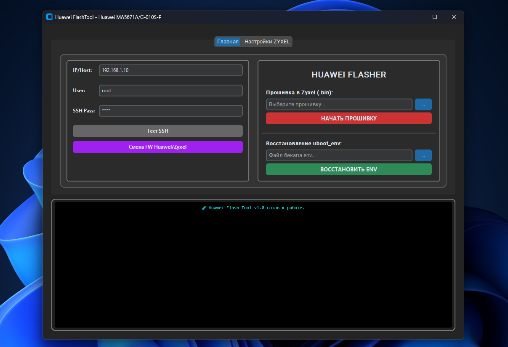

# 🚀 Huawei MA5671A, G-010S-P to Zyxel PMG3000-D20B Flash Tool

[English](#english) | [Русский](#russian)

> [!CAUTION]
> **RU: КРИТИЧЕСКОЕ ПРЕДУПРЕЖДЕНИЕ**
> Перед прошивкой **MA5671A** или **G-010S-P** на прошивку Zyxel убедитесь, что стик загружен с **первого слота (image0)**. Прошивка из-под второго слота (image1) приведет к «окирпичиванию», которое невозможно исправить без использования UART.
>
> **EN: CRITICAL WARNING**
> Before flashing **MA5671A** or **G-010S-P** to Zyxel firmware, ensure the stick is booted from the **first partition (image0)**. Flashing from the second partition (image1) will lead to a brick that can only be recovered via UART.

      

***

## 🌍 English Description

Graphical utility for flashing **Huawei MA5671A, G-010S-P** GPON SFP modules into **Zyxel PMG3000-D20B** and subsequent configuration.

### ✨ Features
* **Dual Boot Switch:** Easy switching between Huawei (Stock) and Zyxel (Mod) boot partitions.
* **Safe Flashing:** Firmware writing with automatic `uboot_env` partition backup.
* **Restore:** Restore the environment partition from a backup file.
* **Zyxel Configuration:** Quick change of parameters via SSH:
    * Serial Number (SN)
    * PLOAM Password
    * MAC Address
    * Equipment ID and Hardware Version

### 🔐 Default Credentials

| Mode | IP Address | Username | Password |
| :--- | :--- | :--- | :--- |
| **Huawei** | `192.168.1.10` | `root` | `перед прошивкой задайте любой пароль` |
| **Zyxel (ssh)** | `10.10.1.1` | `admin` | `admin` |
| **Zyxel (Web)** | `10.10.1.1` | `admin` | `1234` |
| **Zyxel (telnet)** | `10.10.1.1` | `twmanu` | `twmanu` |

### 📦 Installation & Launch
1.  Ensure **Python 3.10+** is installed.
2.  Install dependencies: `pip install -r requirements.txt`
3.  Run the application: `python Huawei_FlashTool.py`
*Or just use the pre-built `HuaweiFlashTool.exe` from the Releases section.*

***

## 🇷🇺 Описание на русском

Графическая утилита для прошивки GPON SFP модулей **Huawei MA5671A, G-010S-P** в **Zyxel PMG3000-D20B** и их последующей настройки.

### ✨ Возможности
* **Dual Boot Switch:** Переключение загрузки между разделами Huawei (сток) и Zyxel (мод).
* **Safe Flashing:** Запись прошивки с автоматическим созданием резервной копии раздела `uboot_env`.
* **Restore:** Восстановление раздела окружения из файла бекапа.
* **Zyxel Configuration:** Быстрая смена параметров через SSH:
    * Серийный номер (SN)
    * Пароль PLOAM
    * MAC-адрес
    * Equipment ID и Hardware Version

### 🔐 Реквизиты доступа

| Режим | IP-адрес | Логин | Пароль |
| :--- | :--- | :--- | :--- |
| **Huawei** | `192.168.1.10` | `root` | `` |
| **Zyxel (ssh)** | `10.10.1.1` | `admin` | `admin` |
| **Zyxel (Web)** | `10.10.1.1` | `admin` | `1234` |
| **Zyxel (telnet)** | `10.10.1.1` | `twmanu` | `twmanu` |

### 📦 Установка и запуск
Перед прошивкой **MA5671A** или **G-010S-P** задайте  любой пароль SSH
1.  Убедитесь, что установлен **Python 3.10+**.
2.  Установите зависимости: `pip install -r requirements.txt`
3.  Запустите программу: `python Huawei_FlashTool.py`
*Либо используйте готовый файл `HuaweiFlashTool.exe` из раздела Releases.*

***

## ⚠️ Disclaimer / Отказ от ответственности

This software is provided "as is". Use it at your own risk. The author is not responsible for any damage to your hardware.

Данное программное обеспечение предоставляется «как есть». Используйте на свой страх и риск. Автор не несет ответственности за любые повреждения вашего оборудования.
